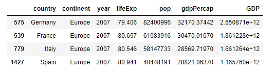

15, 17, 21, 22, 24
## Midterm Corrections
### Question 15
```
import pandas as pd

```
An alias is used while importing pandas in order to have 'pd' represent pandas. This makes it easier when coding because you don't have to type as much
### Question 17
A dataframe is a data structure with rows and columns like a table. Pandas is extremely useful when going through data frames. To read a file in its remote location, use the pandas.read_csv() function. Here is an example of how to read the gapminder file and import it into your work.
```
path_to_data = 'C:/Users/Andy Kim/PycharmProjects/pythonProject1/gapminder.tsv'
data = pd.read_csv(path_to_data, sep = '\t')
```
This code creates the path to the gapminder file and saves it as a tab-seperated values file. This is important because it makes sure that the data structure isn't seperated by commas even though the gapminder file is already seperated by tabs.

To describe the data frame createe, use data.describe(). This shows statistics for each column.
To determine the amount of rows and columns, use data.shape()

An alternative terminology for describing rows and columns is as observations and variables.
### Question 21
Looking only at the year variable of the data frame, we can see that it has regular intervals of 5 years. If we were to add new outcomes and update it, we would add the years 2012 and 2017.
```
oneYear = data['year'] == 1952
data[oneYear]
```
Using this code, I can look at the data from only 2002 and see that each year has 142 instances. Thus, adding the two years would result in 284 new outcomes into the data frame.
### Question 22
The country with the lowest life expectancy in the data frame was Rwanda in 1992,with a life expectancy of 23.599. 
To find this data, I found the index of the minimum life expectancy in the data and then used that index to find all information about that particular observation.
```
MinLifeExp = data['lifeExp'].min()
idx_Min = data['lifeExp'] == MinLifeExp
data[idx_Min]
```
This can be explained by the Rwandan genocide during the civil war that happened from 1990 - 1994.
### Question 24
```
data['GDP'] = data['pop'] * data['gdpPercap']
important_data = data[(data['country'].isin(['Germany', 'Italy', 'France', 'Spain'])) & (data['year'] == 2007)]
important_filtered = important_data.sort_values('GDP', ascending = False)
```
Here:



Stretch: Germany had the most significant increase in total GDP during the previous 5-year period. I modified the previos subset of the 4 countries with the years 2002 and 2007 using the | operator.
```
stretch_data = data[(data['country'].isin(['Germany', 'Italy', 'France', 'Spain'])) & ((data['year'] == 2007) | (data['year'] == 2002))]
```
