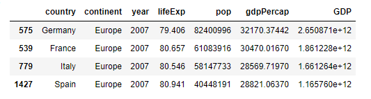

## Question 1
A package is a collection of related modules. A library is a collection of packages that is imported in code. To install a package in Pycharm, click on settings, then 'Python Interpreter'. After pressing the plus sign at the bottom of the page, type in the package and install it. While coding, it is necessary to import the library so that you can access the modules/functions. Here are two examples of importing packages:
```
import pandas as pd
import numpy
```
An alias is used while importing pandas in order to have 'pd' represent pandas. This makes it easier when coding because you don't have to type as much
## Question 2
A dataframe is a data structure with rows and columns like a table. Pandas is extremely useful when going through data frames. To read a file in its remote location, use the pandas.read_csv() function. Here is an example of how to read the gapminder file and import it into your work.
```
path_to_data = 'C:/Users/Andy Kim/PycharmProjects/pythonProject1/gapminder.tsv'
data = pd.read_csv(path_to_data, sep = '\t')
```
This code creates the path to the gapminder file and saves it as a tab-seperated values file. This is important because it makes sure that the data structure isn't seperated by commas even though the gapminder file is already seperated by tabs.

To describe the data frame createe, use data.describe(). This shows statistics for each column.
To determine the amount of rows and columns, use data.shape()

An alternative terminology for describing rows and columns is as vectors.
## Question 3
Looking only at the year variable of the data frame, we can see that it has regular intervals of 5 years. If we were to add new outcomes and update it, we would add the years 2012 and 2017.
```
oneYear = data['year'] == 1952
data[oneYear]
```
Using this code, I can look at the data from only 2002 and see that each year has 142 instances. Thus, adding the two years would result in 284 new outcomes into the data frame.
## Question 4
The country with the lowest life expectancy in the data frame was Rwanda in 1992,with a life expectancy of 23.599. 
To find this data, I found the index of the minimum life expectancy in the data and then used that index to find all information about that particular observation.
```
MinLifeExp = data['lifeExp'].min()
idx_Min = data['lifeExp'] == MinLifeExp
data[idx_Min]
```
This can be explained by the Rwandan genocide during the civil war that happened from 1990 - 1994.
## Question 5
```
data['GDP'] = data['pop'] * data['gdpPercap']
important_data = data[(data['country'].isin(['Germany', 'Italy', 'France', 'Spain'])) & (data['year'] == 2007)]
important_filtered = important_data.sort_values('GDP', ascending = False)
```
Here:



Stretch: Germany had the most significant increase in total GDP during the previous 5-year period. I modified the previos subset of the 4 countries with the years 2002 and 2007 using the | operator.
```
stretch_data = data[(data['country'].isin(['Germany', 'Italy', 'France', 'Spain'])) & ((data['year'] == 2007) | (data['year'] == 2002))]
```
## Question 6
The logical operators &, ==, |, and ^ are used in conditional statements or functions that include two values/variables.

&, the AND operator, returns true if both conditional statements are true.
Example: If the country is Germany AND the year is 2007, return true

==, the Equals operator, returns true if two values/variables are the same.
Example: If 5+5 == 10, return true

|, the OR operator, returns true if one of the conditional statements is true.
Example: If the country is US OR Canada, return true

^, the XOR operator, returns true if only one of the conditional statements is true. It is very similar to the OR operator, with the difference being that it returns false if both statements are true.
Example: If the is a cat XOR a dog, return true. (Returns false if there is a cat and a dog.)
## Question 7

.loc and .iloc access a group of rows and columns. The difference between the two is that .loc always interprets the labels, whereas .iloc interprets the integer positions along the index.
```
data.loc(1:5)
```
Stretch:
```
data.loc(:,1:5)
```

## Question 8
API stands for Application Programming Interface. API's act as middlemen between two machines with a set of rules to communicate. 
```
import os
import requests
url = "https://api.covidtracking.com/v1/states/daily.csv"

data_folder = 'data'
if not os.path.exists(data_folder):
    os.makedirs(data_folder)

file_name = data_folder.replace(' ', '_') + '.csv'

r = requests.get(url)

with open(file_name, 'wb') as f:
    f.write(r.content)

df = pd.read_csv(file_name)
```
## Question 9
The apply() function applies a function along one of the axis of the DataFrame. This is an alternative to looping over a dataframe. It is faster and easier to code because it can go through an entire dataframe with one short line using the apply() function.

## Question 10
Another approach to assign a subset number of variables to another data frame is to use the conditional function isin(). This is the same code used before to find the GDP of the 4 European countries in 2007
```
data['GDP'] = data['pop'] * data['gdpPercap']
important_data = data[(data['country'].isin(['Germany', 'Italy', 'France', 'Spain'])) & (data['year'] == 2007)]
important_data = important_data.sort_values('GDP', ascending = False)
important_data
```
