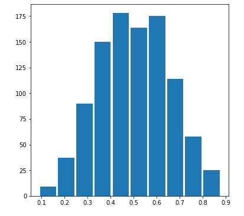
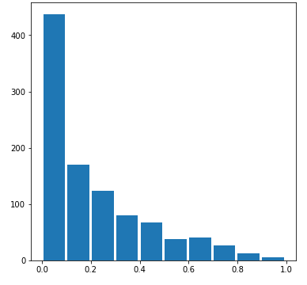
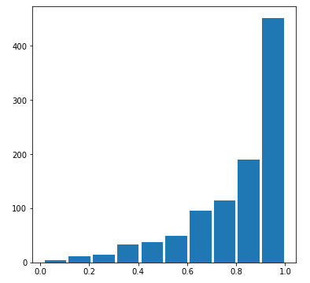

## Project 1

Create a new markdown file and upload it to your GitHub repository. Provide a link to your newly created project2.md file from your main index. Populate your newly created markdown file with your answers to the following questions. Each question is worth 2.5 points. Upload your response no later than midnight on Wednesday, March 3rd.

### Question 1
Continuous data is data that can take any value within a range. For example, the temperature is continuous data because it could be between 45 and 46 degrees outside. The temperature can be infinitely specific like 45.5565 degrees.

Ordinal data is a categorical data that has a scale. For example, the amount of clouds in the sky could be from clear to somewhat cloudy to cloudy. There isn't an equal difference between each scale.

Nominal data is a categorical data  that doesn't have any values. For example, sex is nominal data because it can be seperated into male or female, but doesn't have any particular order or scale.

A model using these three types of data could be a study on people carrying around umbrellas. Scientists discovered that people carry around umbrellas depending on three factors: outside temperature, cloud coverage, and sex.

Features: Outside Temp, Cloud Coverage, Sex
Target: Whether or not a person is carrying an umbrella

Scientists can make hypotheses on specific people by stringing together past observations on each of the features. For example, if data shows that females are more likely to carry an umbrella when the temperature is low and there are a lot of clouds, then scientists can predict that under similar conditions, the person is more likely to be carrying an umbrella than not.

### Question 2
Comment out the seed from your randomly generated data set of 1000 observations and use the beta distribution to produce a plot that has a mean that approximates the 50th percentile. Also produce both a right skewed and left skewed plot by modifying the alpha and beta parameters from the distribution. Be sure to modify the widths of your columns in order to improve legibility of the bins (intervals). Include the mean and median for all three plots.
```

Median: 0.504912
Mean: 0.502757
------------------------------

Median: 0.127099
Mean: 0.207406
--------------------------------

Median: 0.874563
Mean: 0.809239
```

### Question 3
Using the gapminder data set, produce two overlapping histograms within the same plot describing life expectancy in 1952 and 2007. Plot the overlapping histograms using both the raw data and then after applying a logarithmic transformation (np.log10() is fine). Which of the two resulting plots best communicates the change in life expectancy amongst all of these countries from 1952 to 2007?
```

```
### Question 4
Using the seaborn library of functions, produce a box and whiskers plot of population for all countries at the given 5-year intervals. Also apply a logarithmic transformation to this data and produce a second plot. Which of the two resulting box and whiskers plots best communicates the change in population amongst all of these countries from 1952 to 2007?```

```
