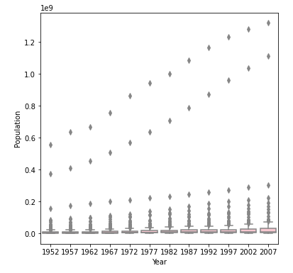
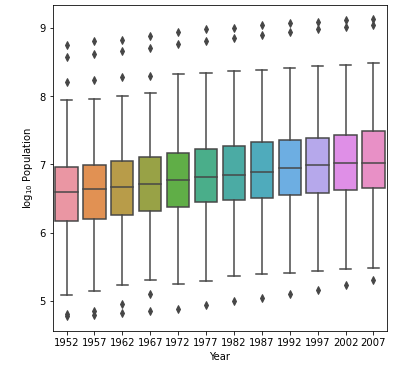

## Project 2
### Question 1
Continuous data is data that can take any value within a range. For example, the temperature is continuous data because it could be between 45 and 46 degrees outside. The temperature can be infinitely specific like 45.5565 degrees.

Ordinal data is a categorical data that has a scale. For example, the amount of clouds in the sky could be from clear to somewhat cloudy to cloudy. There isn't an equal difference between each scale.

Nominal data is a categorical data  that doesn't have any values. For example, sex is nominal data because it can be seperated into male or female, but doesn't have any particular order or scale.

A model using these three types of data could be a study on people carrying around umbrellas. Scientists discovered that people carry around umbrellas depending on three factors: outside temperature, cloud coverage, and sex.

Features: Outside Temp, Cloud Coverage, Sex
Target: Whether or not a person is carrying an umbrella

Scientists can make hypotheses on specific people by stringing together past observations on each of the features. For example, if data shows that females are more likely to carry an umbrella when the temperature is low and there are a lot of clouds, then scientists can predict that under similar conditions, the person is more likely to be carrying an umbrella than not.

### Question 2


The mean approximates the 50th percentile at 0.5027

Median: 0.504912

Mean: 0.502757

------------------------------------------------------------------------


This plot is skewed right with an alpha of 0.5 and a beta of 2.0

Median: 0.127099

Mean: 0.207406

------------------------------------------------------------------------


This plot is skewed left with an alpha of 2.0 and a beta of 0.5


Median: 0.874563

Mean: 0.809239


### Question 3


By adding np.log10(), the data is transformed.
```
plt.hist(np.log10(df_lifeExp1952['lifeExp']), rwidth=0.9, label=1952, alpha=0.5)
plt.hist(np.log10(df_lifeExp2007['lifeExp']), rwidth=0.9, label=2007, alpha=0.5)
```
The resulting plot has a different scale of Life Expectancy, making the increase in Life Expectancy over the years easier to see. The lower variances in the second plot allows the difference to be clearer.
### Question 4
Using the seaborn library of functions, produce a box and whiskers plot of population for all countries at the given 5-year intervals. Also apply a logarithmic transformation to this data and produce a second plot. Which of the two resulting box and whiskers plots best communicates the change in population amongst all of these countries from 1952 to 2007?






In contrast to Question 3, the difference between the normal and logarithmic plots is much greater here. The normal plot is extremely hard to see, due to the outliers drastically changing the median, mode, and interquartile ranges of the boxes. The Logarithmic plot does a much better job of spreading the data out so the "boxes and whiskers" are easily visible. Thus, the comparison of the population over the years among all of the countries is better communicated.
