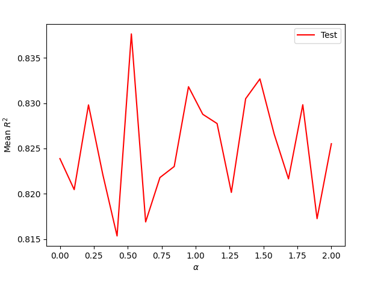

## Project 5

Create a new markdown file and upload it to your GitHub repository. Provide a link to your newly created project5.md file from your main index. Populate your newly created markdown file with your answers to the following questions. This lab is worth 10 points. Upload your response no later than 5PM on Saturday, April 17th.
Download the anonymized dataset describing persons.csv from a West African county and import it into your PyCharm project workspace (right click and download from the above link or you can also find the data pinned to the slack channel). First set the variable wealthC as your target. It is not necessary to set a seed.

### Question 1

Perform a linear regression and compute the MSE. Standardize the features and again computer the MSE. Compare the coefficients from each of the two models and describe how they have changed.

Unstandardized Training and Testing MSE's: 0.4428 and 0.4437
Standardized Training and Testing MSE's: 0.4428 and 0.4436
Unstandardized R^2: 0.7358 and 0.7351
Standardized R^2: 0.7358 and 0.7351

Standardizing the data did not change any of the results. Most the the changes were in the 10,000's place, and often isn't even visible when rounding to 4 digits.
### Question 2
Run a ridge regression and report your best results.

I ran the ridge regression for alpha values between 70 and 80, finding a strongest alpha value of 76. Using this, I got a training score of 0.7341 and a testing score of 0.7353.

### Question 3
Run a lasso regression and report your best results.

I ran the lasso regression for alpha values between 0.0002 and 0.0003, finding a strongest alpha value of 0.00026. Using this, I got a training score of 0.73577 and a testing score of 0.73519.

### Question 4
Repeat the previous steps using the variable wealthI as your target.

Linear Regression
Average Testing MSE: 1,750,149,378.817456????
Unstandardized R^2: 0.0.8258 and 0.8251
Standardized R^2: 0.8258 and 0.8252

The coefficients from 'WealthI' are much larger than 'WealthC,' which is a good indication of the features having a bigger impact on the target. The MSE is in the billions, which I'm not certain at all about.

Ridge Regression
Training R squared: 0.82584
Testing R squared: 0.82502
optimal alpha: 93.9474

Lasso regression
Training R squared: 0.8258
Testing R squared: 0.82502
optimal alpha: 1.067

Both the Ridge and Lasso regressions did not improve much from the Linear regression. 
### Question 5

Which of the models produced the best results in predicting wealth of all persons throughout the smaller West African country being described? Support your results with plots, graphs and descriptions of your code and its implementation. You are welcome to incorporate snippets to illustrate an important step, but please do not paste verbose amounts of code within your project report. Alternatively, you are welcome to provide a link in your references at the end of your (part 1) Project 5 report.

After all of the R^2 calculations, the Linear regression of WealthI unstandardized performed the best, although it was only better than the standardized model by a miniscule amount. In the same way, the Ridge and Lasso regressions of WealthI performed very similarly, so I don't think any model was particularly better than the other. However, the WealthC models all performed better than the WealthI models. Thus, I would say picking a WealthI model over a WealthC model would be the best choice.

Here is the Lasso Regression from WealthC:

Here is the Lasso Regression from WealthI:

